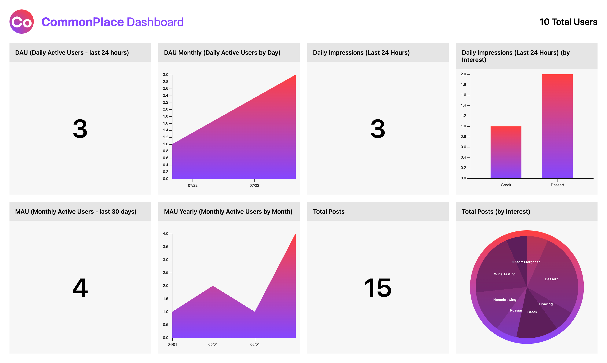

# CommonPlace Monorepo

CommonPlace is a social media app where users can connect over their hobbies. Users can send messages, browse content, and upload anything they want (images, video, audio, and text).

## Packages

- commonplace-api - API for App(s) and Dashboard (GraphQL Nexus)
- commonplace-dashboard - KPI Monitoring Dashboard (visx)
- commonplace-emails - Notification Emails (Foundation for Emails)
- commonplace-utilities - Shared Code (TypeScript)
- commonplace-web - User Web Application (React, Next.js)
- CommonPlaceMobile - User Mobile Application (React Native)

## Startup

### Prerequisites

- Install and initialize Docker, Postgres

Local Postgres database lives outside Docker container just as it does on production.

### Database Prepation

- `cd packages/commonplace-api`
- `npm i`
- `npm run db:seed`

### Initialize

- `cd ../..`
- `npm run dev` to start docker-compose

## Deployment

See `buildspec.yml` for AWS CodeBuild configuration
